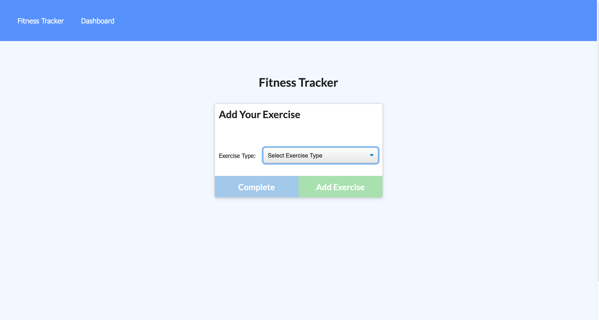

# workout-input 
A personal workout tracker. Express routes and a Mongo database with Mongoose schema have been applied to existing front end code.

## Table of Contents
1. [Installation](#installation)
2. [Usage](#usage)
3. [License](#license)
4. [Questions](#questions)

## Installation
Navigate to https://workout-input.herokuapp.com

## Usage
- To track a new workout, click "New Workout": - Select "Resistance" or "Cardio", and answer subsequent prompts. - Click "Add Exercise", and repeat for each exercise in your workout. - When complete, click "Complete" to see your most recent workout stats. - Click "Continue workout" to resume that workout, - or click "New Workout" to begin a new workout. 
- Click "Dashboard" at the top of the page to see a chart of previous workout durations, as well as a bar graph showing how many pounds were lifted in each workout.  

## License
This project is [MIT](https://opensource.org/licenses/MIT) licensed.

## Questions
Additional questions? Please contact me at sammn721@gmail.com!
For more projects, please visit my [GitHub profile](https://github.com/sammn721).
